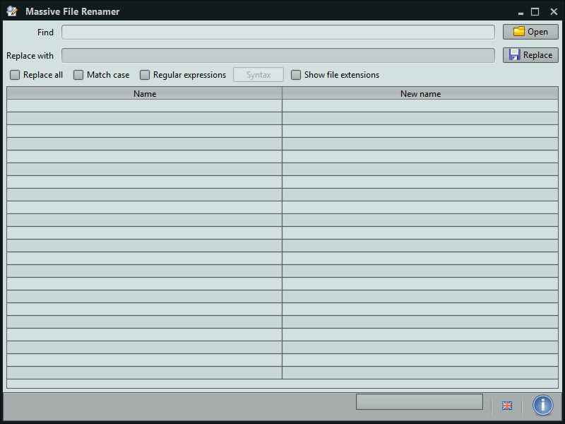

 Massive File Renamer
==================

This software will allow you to easily rename multiple files. It's very fast and simple!

For advanced users and developers, it is possible to use **regular expressions**.

Available for **Windows** and **Linux**. Other OS were not tested yet....

Requirements: JRE 6 or higher.

## Download ##
[**Download the latest release of Massive File Renamer**](http://ivanrf.com/en/portfolio-posts/massive-file-renamer/). There you will find installers for Windows, Linux and Mac OS X.

## Contributions ##
You can contribute with **translations** :)<br/>
The property files are located in [src/com/ivanrf/renamer/resources](src/com/ivanrf/renamer/resources). Use [Labels.properties](src/com/ivanrf/renamer/resources/Labels.properties) as a reference.

Also, it would be nice if someone could **test** it under any **OS** other than Windows or Linux (Ubuntu) and tell me if it works as expected :) 

## Screenshots ##


Example of a massive file renaming


Example of a massive file extension renaming


## Settings ##

It is possible to change the app skin by selecting one of the Substance skins from the application context menu.

In addition, you can set the default values for the *Find* and *Replace with* fields. In order to do that, edit ```config.ini``` and set the values for ```Field.DefaultFind``` and ```Field.DefaultReplace```, respectively.
